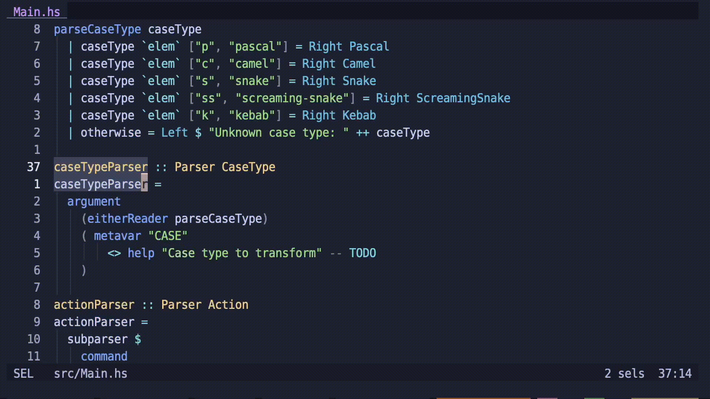

# hx-utils

A small collection of utilities to use with [Helix](https://helix-editor.com/).

## Installation

### Pre-requisites

Ensure you have `cargo` installed - see [here](https://doc.rust-lang.org/cargo/getting-started/installation.html) for further information.

### Instructions

Clone the repo to your local machine and run

```sh
$ cargo install --path .
```

Optionally, add a shorter alias for easier use in Helix. For instance, to use `u` as an alias for `hx-utils`:

```sh
$ ln -s $(which hx-utils) ~/.local/bin/u
```

## Usage in Helix

Select the text you want to modify, hit `|` and then type the command you'd like to apply to the text, such as `u c s` to convert some text to snake case, and hit enter.



## Features

### Case conversion

```sh
$ echo "this is some Text" | u c p  # pascal case
ThisIsSomeText
$ echo "this is some Text" | u c c  # camel case
thisIsSomeText
$ echo "this is some Text" | u c s  # snake case
this_is_some_text
$ echo "this is some Text" | u c ss # screaming snake case
THIS_IS_SOME_TEXT
$ echo "this is some Text" | u c k  # kebab case
this-is-some-text
```
